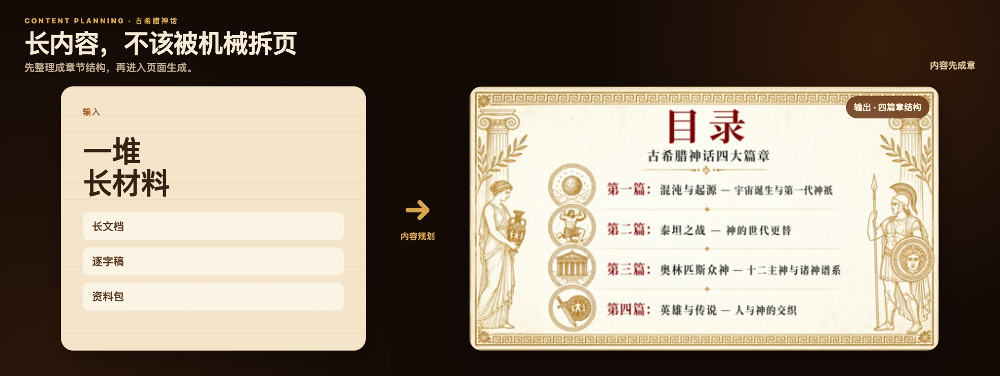

<div align="center">

<h1>
  
</h1>

### 让 AI PPT 从“能生成”，走向“敢交付”

把主题、文档、逐字稿、Logo、产品图和参考图，变成一套风格一致、内容可控、品牌准确、可以继续修改的 PPT。

</div>


<p align="center"><sub>首屏中的 Apple Vision Pro 为公开资料 Demo；产品界面经过脱敏，展示内容均可公开。</sub></p>

## 四个关键能力，直接看结果

你可以直接看到一套 PPT 是否跨页一致，品牌素材是否准确，风格是否可选，以及长内容如何先形成结构。

### 品牌素材：原 Logo、原产品图，准确进入最终页面


### 风格选择：同一份内容，也可以先看两种方向


### 内容规划：长材料先变成结构，再进入页面



## 你真正买到的，是四种确定性

| 你需要的确定性 | PPT God 如何做到 |
| --- | --- |
| **成套** | 封面、数据、产品和结束页各有变化，但始终属于同一视觉系统 |
| **可控** | 生成前确认每页内容、页面角色和视觉方向，生成后可继续改单页或整套 |
| **准确** | Logo、图表、UI 和产品素材作为事实依据，不让 AI 随意重画 |
| **可交付** | 最终导出可以继续检查、修改和交付的 PPTX，而不是一组灵感图 |

**成套，不是拼图 · 可控，不是盲盒 · 准确，不是重画 · 可交付，不是只供欣赏**

## 从材料到可交付 PPTX，只做五个关键决定

1. **输入材料**：主题、Markdown、文档、逐字稿、旧 PPT、PDF 都可以成为起点。
2. **确认每页内容**：先看标题、正文重点、页面角色和讲述顺序。
3. **选择视觉方向**：比较不同风格提案，确定这一套 PPT 的视觉系统。
4. **决定素材如何使用**：Logo、图表、产品、人物和氛围图采用不同处理方式。
5. **生成、微调并导出**：逐页检查，继续修改，最后导出可编辑 PPTX。

## Logo、图表与产品图，不能用同一种方式处理

| 素材处理方式 | 适合什么 | 结果标准 |
| --- | --- | --- |
| **精确粘贴** | Logo、二维码、图表、UI 截图和原始证据 | 保持事实不变，并在落版时自动避让文字 |
| **智能融合** | 场景、人物和氛围图 | 进入整体构图、光影与视觉风格 |
| **精修融合** | 复杂产品与高还原要求的客户素材 | 先融入画面，再校准主体边缘、比例和关键细节 |

## 适合哪些工作

| 使用场景 | 你交给 PPT God 什么 | 最终解决什么问题 |
| --- | --- | --- |
| 品牌 / 产品发布 | Logo、产品图、发布内容 | 品牌准确，产品可信，整套像发布会 |
| 商务 / 研究汇报 | 报告、数据、方案材料 | 内容先理清，重点更适合演示 |
| 课程 / 知识分享 | 长文档、逐字稿、知识资料 | 从机械拆页变成有讲述节奏的课件 |
| 创意 / 生活方式 | 想法、参考图、审美方向 | 先比较风格，再生成完整视觉系统 |

## 每个案例，都会让下一次默认更稳

真实案例不只是作品，也是 PPT God 的训练场。每一次交付中的反馈，都会先脱敏为回归案例，再沉淀成可复用的能力与质量检查。

**真实反馈 → 脱敏回归 → 能力升级 → 下一次默认更稳**

## 当前状态与开始使用

PPT God 正在持续迭代，目前主要以本地整合版和定向测试方式使用。正式的一键安装与公开体验入口准备中。

- 想持续关注：可以 Star 或 Watch 本仓库。
- 想反馈问题或提出需求：欢迎通过 [Issues](https://github.com/JoeSangAI/PPT-GOD/issues) 留言。
- 已经运行本地整合版：默认从 `http://localhost:8000` 进入产品界面。

<details>
<summary><strong>Agent / CLI 接入</strong></summary>

外部 Agent 可以先检查本地服务、账号和项目连接：

```bash
python scripts/pptgod_cli.py doctor
python scripts/pptgod_cli.py capabilities
python scripts/pptgod_cli.py whoami
python scripts/pptgod_cli.py list-projects
```

更新已有项目的内容规划时，默认只预览差异；确认后再应用：

```bash
python scripts/pptgod_cli.py update-content-plan <project_id> path/to/plan.md
python scripts/pptgod_cli.py update-content-plan <project_id> path/to/plan.md --apply --open
```

完整格式和工作流见 [Agent 内容规划说明](./docs/agent/content-planning-playbook.md)。

</details>

---

Apple、Apple Vision Pro 及相关标识归其权利人所有。示例资料来源：[Apple Vision Pro 技术规格](https://www.apple.com/apple-vision-pro/specs/)、[Apple Vision Pro 企业应用](https://www.apple.com/newsroom/2024/04/apple-vision-pro-brings-a-new-era-of-spatial-computing-to-business/)。示例仅用于展示 PPT God 的排版与素材控制能力，不代表 Apple 合作或背书。
