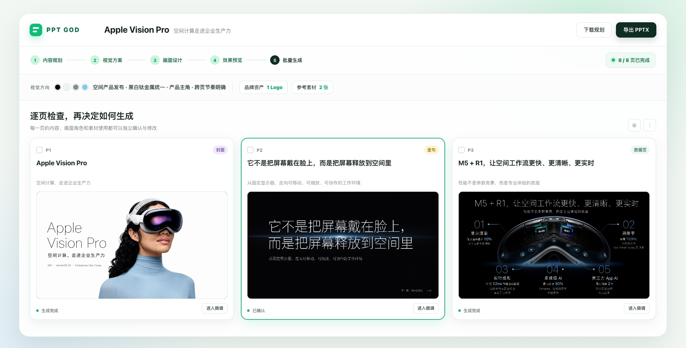
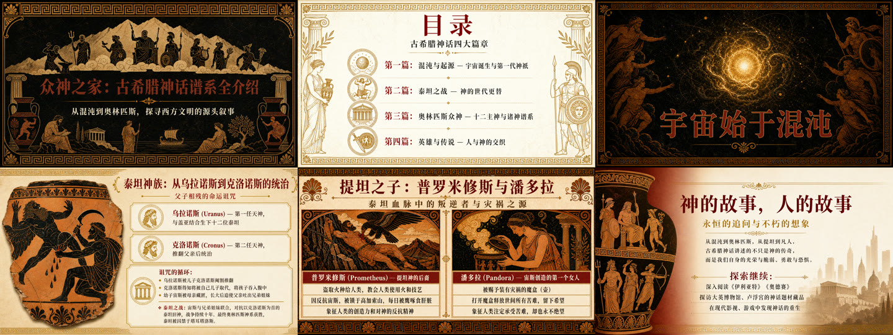

<div align="center">

# PPT God

### 从材料到一整套真正能交付的 PPT

主题、文档、逐字稿、Logo、产品图、参考图和修改意见，都可以成为一套好 PPT 的起点。

</div>


<p align="center"><sub>首屏中的 Apple Vision Pro 为公开资料 Demo；产品界面经过脱敏，展示内容均可公开。</sub></p>

## 真正的交付，不只是“生成了几张图”

| 使用场景 | PPT God 解决什么问题 |
| --- | --- |
| 品牌 / 产品发布 | Logo 不重画，产品主体不跑偏 |
| 商务 / 研究汇报 | 每页内容先确认，再进入视觉生成 |
| 课程 / 知识分享 | 长材料变成有讲述节奏的一整套页面 |
| 创意 / 生活方式 | 风格方案可定制、可比较、可选择 |

## Logo 必须是那个 Logo，产品也必须是那个产品

原始 Logo、原始产品图和最终页面放在一起，才能看清“保留了什么、融合了什么”。下面的 Apple Vision Pro 非官方 Demo 中，Logo 原样保留，产品主体经过精修融合进入最终版式。


一页准确还不够。封面、数据、生产力、设计协作、培训、医疗教育和结尾页，都需要属于同一个视觉系统——不是八张随机好看的图。


<p align="center"><sub>示例基于 Apple 公开资料制作，仅用于展示 PPT God 的排版与素材控制能力，不代表 Apple 合作或背书。</sub></p>

## 同一份内容，先看风格提案，再决定往哪做

PPT God 不把“风格”锁死在一个模板里。同一份品牌企划，可以先比较不同方向，再选择真正适合这次任务的一套视觉语言。


选择“深绿草本标本馆”后，8 页不是各自发挥，而是共同继承深松针绿、古铜细线、标本目录式版式和克制静物语言。


## 参考图有三种命运：保留、融合、精修


- **精确粘贴｜事实不改**：Logo、二维码、图表、UI 截图和原始证据保持原样，并在落版时自动避让文字。
- **智能融合｜氛围融入**：场景、人物和氛围图进入整体构图、光影与视觉风格。
- **精修融合｜融合 + 高还原**：先融入画面，再校准主体边缘、比例和关键细节，适合复杂产品与高还原要求。

## 批量生成之前，每一页都看得懂、选得准、改得动

在批量生成前，先确认每页标题、正文、页面类型、参考素材和视觉方向；需要修改时，可以选中单页、多页或整套 PPT 继续调整。



## 真实案例不只是作品，也是产品的训练场

PPT God 采用案例驱动的自迭代体系：每一次真实交付中的反馈，都会先脱敏为回归案例，再沉淀成可复用的能力与质量检查，让后续项目默认受益。

**真实反馈 → 脱敏回归 → 能力升级 → 下一次默认更稳**

## 不只做品牌发布，也能吃下课程与长内容

商业品牌只是其中一种场景。公开知识主题、课程课件和长文档，同样需要内容取舍、页面节奏和跨页一致性。



## 从材料到可交付 PPT

**输入主题或材料 → 确认每页内容 → 选择风格与素材路线 → 生成、微调并导出 PPTX**

PPT God 支持主题、Markdown、文档、逐字稿、旧 PPT、PDF、Logo、产品图、截图和视觉参考。最终输出可以在 PowerPoint、WPS 或 Keynote 中继续修改。

<details>
<summary><strong>Agent / CLI 接入</strong></summary>

外部 Agent 可以检查本地服务与项目连接：

```bash
python scripts/pptgod_cli.py doctor
python scripts/pptgod_cli.py capabilities
python scripts/pptgod_cli.py whoami
python scripts/pptgod_cli.py list-projects
```

更新已有项目的内容规划时，默认只预览差异；确认后再应用：

```bash
python scripts/pptgod_cli.py update-content-plan <project_id> path/to/plan.md
python scripts/pptgod_cli.py update-content-plan <project_id> path/to/plan.md --apply --open
```

完整格式与工作流见 [Agent 内容规划说明](./docs/agent/content-planning-playbook.md)。

</details>

---

Apple、Apple Vision Pro 及相关标识归其权利人所有。示例资料来源：[Apple Vision Pro 技术规格](https://www.apple.com/apple-vision-pro/specs/)、[Apple Vision Pro 企业应用](https://www.apple.com/newsroom/2024/04/apple-vision-pro-brings-a-new-era-of-spatial-computing-to-business/)。
