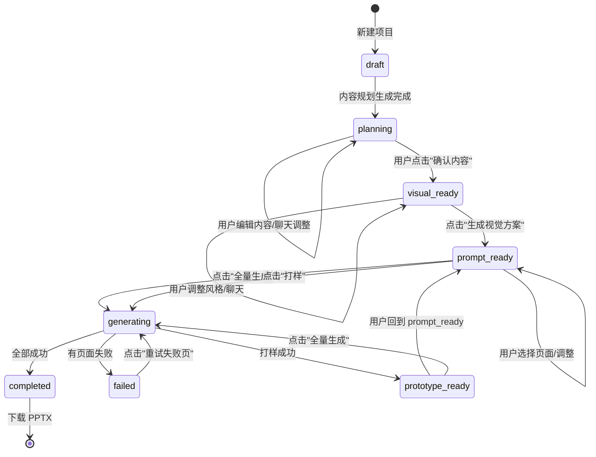
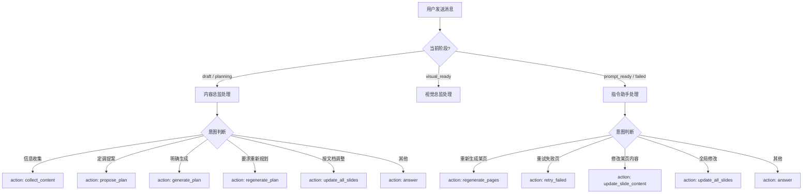

# PPT GOD 流程梳理与用户旅程地图

> **目标**：把当前混乱的流程用结构化方式重新梳理，找到"什么状态下该做什么、什么状态下不该做什么"的清晰边界。

---

## 一、用什么工具描述最合适？

| 工具 | 用途 | 是否适合当前场景 |
|------|------|-----------------|
| **甘特图** | 时间线管理（谁什么时候做什么） | ❌ 不适合，这不是排期问题 |
| **决策树** | "如果 A 则走分支 1，如果 B 则走分支 2" | ✅ 适合 Agent 聊天意图判断 |
| **状态机（State Machine）** | "项目在某个状态，只能做某些事，做完后进入下一个状态" | ✅ **最适合**，这是核心框架 |
| **用户旅程地图** | "用户在这个阶段看到什么、能点什么、感受如何" | ✅ 适合查漏补缺 |

**结论**：用**状态机**做骨架，用**用户旅程地图**填血肉，用**决策树**处理 Agent 聊天的分叉。

---

## 二、PPT GOD 状态机（当前现状）



### 🔴 当前混乱点（状态机视角）

| 混乱现象 | 状态机解释 | 应该怎么修 |
|---------|-----------|-----------|
| 用户在 planning 阶段能看到"全量生成"按钮 | planning 状态允许了 generating 的转移 | planning 状态禁用生成按钮 |
| 用户在 content 阶段发消息，视觉总监也启动了 | planning 状态没有屏蔽视觉总监入口 | 只有 visual_ready 才能切换角色 |
| 所有页面都失败后显示"一键重试" | failed 状态直接回 generating，没有检查前提 | 重试前检查是否有 prompt_text |
| 上传参考图/Logo 按钮始终可见 | 没有按状态控制按钮显示 | 视觉相关按钮只在 visual_ready 显示 |

---

## 三、用户旅程地图（User Journey Map）

### Stage 1: 项目初始化（draft）

| 用户行为 | 前端显示 | 后端状态 | Agent 角色 | 可用操作 |
|---------|---------|---------|-----------|---------|
| 新建项目 | 空白项目 | `draft` | 内容总监 | 输入主题、上传文档、聊天 |
| 上传 content_plan.md | 显示文档名 | `draft` | 内容总监 | 继续聊天 |
| 说"开始生成" | Agent 思考中 | `draft` → `planning` | 内容总监 | 等待生成 |

**当前问题**：draft 阶段没有文档预览，用户不知道文档是否上传成功。

---

### Stage 2: 内容规划（planning）

| 用户行为 | 前端显示 | 后端状态 | Agent 角色 | 可用操作 |
|---------|---------|---------|-----------|---------|
| 查看生成的 slides | 10 页卡片 | `planning` | 内容总监 | 编辑标题/正文、拖拽排序 |
| 点击单页编辑 | 右侧展开编辑表单 | `planning` | 内容总监 | 改标题、改正文、保存 |
| 发送"按文档重新生成" | Agent 思考... | `planning` | 内容总监 | 等待重新生成 |
| 收到"已生成"反馈 | 卡片刷新 | `planning` | 内容总监 | 继续调整 |
| 点击"确认内容，请视觉总监" | 加载中... | `planning` → `visual_ready` | 视觉总监 | 等待风格提案 |

**当前问题**：
1. 用户发送"按文档重新生成"后，Agent 口头答应但实际没有触发重新生成（**已修复**）
2. 重新生成后页数还是 10 页不是 25 页（根因：generate_content_plan 不读文档，默认 page_count=10）
3. 全局模式下缺少撤销/重做（**已修复**）

---

### Stage 3: 视觉方案（visual_ready）

| 用户行为 | 前端显示 | 后端状态 | Agent 角色 | 可用操作 |
|---------|---------|---------|-----------|---------|
| 视觉总监介入 | 显示风格提案 | `visual_ready` | 视觉总监 | 选择风格、上传参考图 |
| 选择风格 | 风格高亮 | `visual_ready` | 视觉总监 | 确认风格或更换 |
| 点击"生成视觉方案" | 生成中... | `visual_ready` → `prompt_ready` | 视觉总监 | 等待生成 |

**当前问题**：
1. 风格提案生成可能超时（之前是同步阻塞 120s+，**已改为异步**）
2. 视觉相关按钮在 planning 阶段就显示了（**已删除**）

---

### Stage 4: 生图 Prompt（prompt_ready）

| 用户行为 | 前端显示 | 后端状态 | Agent 角色 | 可用操作 |
|---------|---------|---------|-----------|---------|
| 查看 prompt | 每页有 prompt 文本 | `prompt_ready` | 指令助手 | 重新生成某页 prompt |
| 勾选页面 | 页面卡片有选中框 | `prompt_ready` | 指令助手 | 打样选中页 |
| 点击"全量生成" | 进度条 + 状态变为 generating | `prompt_ready` → `generating` | 指令助手 | 等待生成 |

**当前问题**：
1. prompt_ready 阶段如果没有 prompt_text（比如内容规划重新生成后没走视觉方案），全量生成会全部失败
2. 失败页没有明确的错误原因展示（用户只看到 ❌，不知道是因为没 prompt 还是因为 DeerAPI 欠费）

---

### Stage 5: 图片生成（generating）

| 用户行为 | 前端显示 | 后端状态 | Agent 角色 | 可用操作 |
|---------|---------|---------|-----------|---------|
| 等待生成 | 进度条 + 每页状态 updating | `generating` | — | 停止生成 |
| 某页完成 | 显示缩略图 | `generating` | — | 继续等待 |
| 某页失败 | 显示 ❌ + 重试按钮 | `generating` → `failed` | — | 点击重试 |
| 全部完成 | 显示"下载 PPTX" | `generating` → `completed` | — | 下载 |

**当前问题**：
1. DeerAPI 欠费时所有页面失败，用户不知道原因（日志显示 `insufficient_user_quota`）
2. 失败后重试仍然失败（因为根本原因是欠费，不是网络问题）

---

## 四、Agent 聊天决策树



### 🔴 决策树当前问题

| 问题 | 现象 | 修复状态 |
|------|------|---------|
| 用户说"按文档重新生成"，Agent 只口头答应 | LLM 误判为 `answer` | ✅ **已修复**（prompt 加了规则） |
| 用户说"重新规划页面"，Agent 不知道触发 regenerate_plan | 缺少 `regenerate_plan` action | ✅ **已修复** |
| 用户说"按 content plan 来"，页数不变 | `update_all_slides` 只能改内容不能增页 | ⚠️ 需要用户确认：是否需要 Agent 能触发重新生成（已加 `regenerate_plan`） |

---

## 五、混乱的根源总结

### 根因 1：状态没有严格保护
- planning 阶段不应该能看到"全量生成"按钮
- prompt_ready 阶段不应该能在没有 prompt 的情况下生成
- 视觉相关按钮不应该在 content 阶段出现

### 根因 2：内容规划生成不读文档
- `generate_content_plan` 只接收 topic，默认 10 页
- 完全不读取用户上传的 content_plan.md
- 导致页数和内容与文档脱节

### 根因 3：失败原因不透明
- 页面失败后只显示 ❌，不显示具体原因
- 用户不知道是因为 DeerAPI 欠费、缺少 prompt、还是网络问题

### 根因 4：Agent 能力边界不清
- Agent 能承诺的事和实际能做的事不一致
- 比如 Agent 说"正在重新生成 25 页"，但实际只生成了 10 页

---

## 六、建议的修复优先级

```
P0 ── 内容规划读取文档（解决页数不对、内容不对）
     └─ 修改 generate_content_plan，注入文档原文
     └─ page_count 从文档推断或用户指定

P1 ── 状态保护（解决流程乱跳）
     └─ 每个状态只显示该状态允许的操作按钮
     └─ 不允许的操作按钮变灰 + tooltip 提示"请先完成 X"

P2 ── 失败原因透明（解决用户困惑）
     └─ 页面失败后显示具体错误（欠费/无 prompt/网络）
     └─ 如果是欠费，提示用户充值而不是无限重试

P3 ── Agent 反馈明确
     └─ regenerate_plan 完成后明确说"已生成 X 页"
     └─ 如果实际生成页数和预期不一致，主动告知用户
```

---

## 七、下一步行动建议

**我的判断**：你现在最痛的点是**"重新生成内容规划后页数不对"**，这是 P0 问题。只有这个修好了，后面的流程才有意义。

**推荐路径**：
1. **先修 P0**：让 `generate_content_plan` 读取文档 → 你测试 25 页内容规划是否正确生成
2. **再修 P1**：加状态保护 → 你测试流程是否还乱跳
3. **最后修 P2/P3**：优化体验

如果你同意这个优先级，我们现在就开始修 P0。
